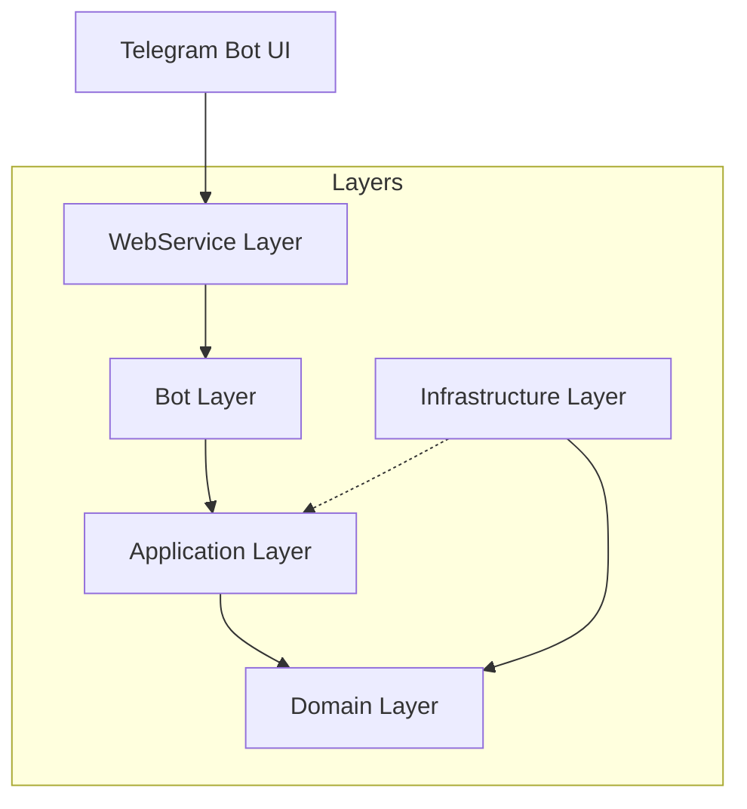

# Architecture

ArchieHealthTracker follows a Clean Architecture approach to ensure maintainability, testability, and separation of concerns.

## System Components

### 1. Domain Layer
Contains core entities, enums, and repository interfaces. It has no dependencies on other layers.

### 2. Application Layer
Implements business logic and use cases. It depends only on the Domain layer.

### 3. Infrastructure Layer
Handles data persistence using Entity Framework Core and implements repository interfaces defined in the Domain layer.

### 4. Bot Layer
Contains Telegram bot command handlers and navigation logic. It interacts with the Application layer to perform actions.

### 5. WebService Layer
The entry point of the application. It configures dependency injection, hosts the Web API for Telegram webhooks, and manages application startup.
