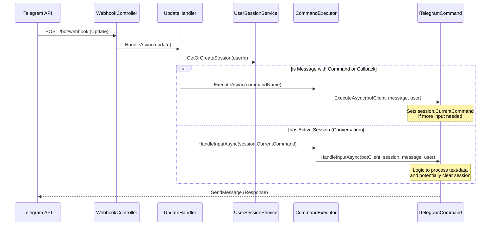

# Bot Command & Input Flow

The bot uses a sophisticated state-machine-like structure to handle both direct commands (e.g., `/start`) and multi-step conversational inputs (e.g., entering weight after clicking a button).

## Architecture Diagram

## Key Components

### 1. UpdateHandler
The primary entry point for all incoming Telegram `Update` objects. It decides whether to treat the message as a new command or a continuation of an existing conversation based on the user's session state.

### 2. UserSessionService
Manages the temporary state of each user. If a user starts a command that requires further input (like `WeightCommand`), their ID and the command name are stored in the session.

### 3. CommandExecutor
A factory and dispatcher that finds the appropriate implementation of `ITelegramCommand` based on the command name.

### 4. ITelegramCommand
Every command implements two main methods:
*   `ExecuteAsync`: Triggered when the command is first called (e.g., from a menu button). Usually sends an initial prompt and sets the session state.
*   `HandleInputAsync`: Triggered when the user sends a message while this command is active in their session.

## Example: Weight Logging Flow
1.  **User** clicks "⚖️ Вес".
2.  **UpdateHandler** identifies this as the `Weight` command.
3.  **WeightCommand.ExecuteAsync** is called:
    *   Sends message: "Please enter current weight (kg):"
    *   Sets user session `CurrentCommand = "Weight"`.
4.  **User** sends "12.5".
5.  **UpdateHandler** sees active session for "Weight".
6.  **WeightCommand.HandleInputAsync** is called:
    *   Parses "12.5".
    *   Saves to database via `IHealthService`.
    *   Clears user session.
    *   Sends confirmation.
